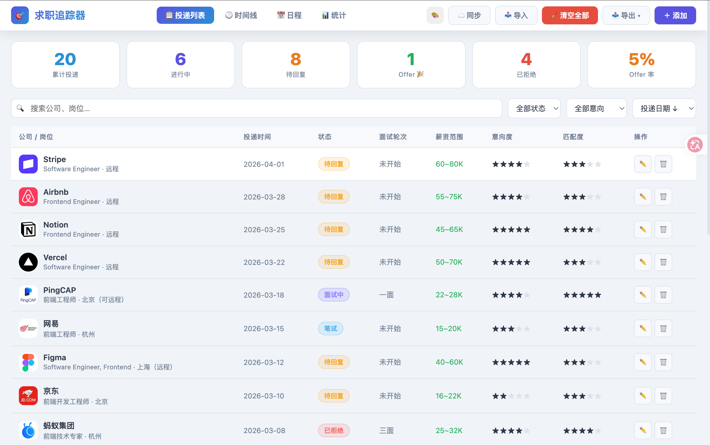
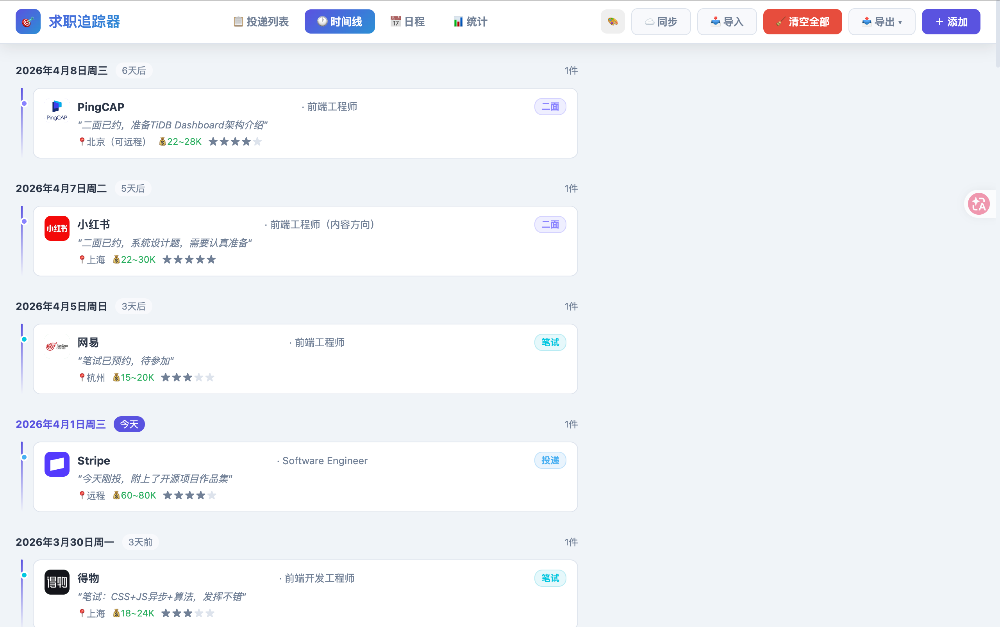
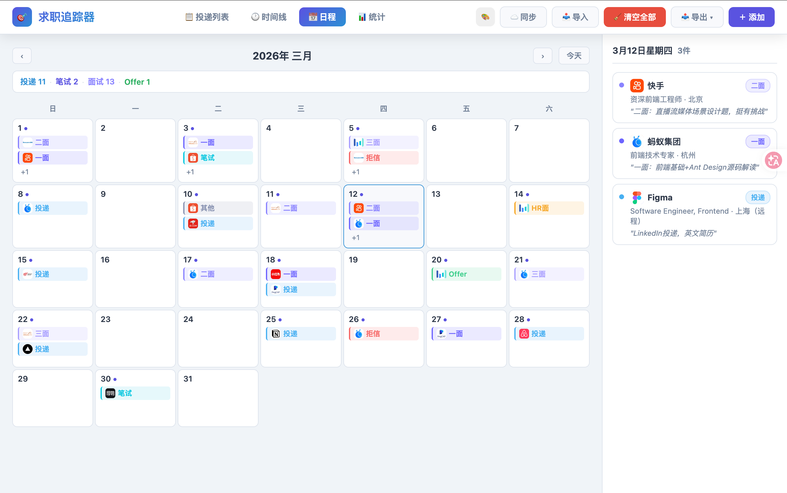
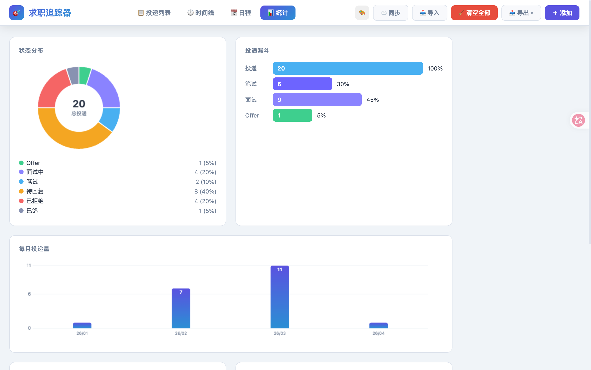

# Job Tracker

一个专注求职流程管理的记录工具，覆盖从投递到 Offer 的关键节点。

## 🚀 Live Demo

- 在线地址：[job-tracker.zhouxin.space](https://job-tracker.zhouxin.space)

## ✨ Highlights

- 🧭 记录完整求职流程：投递、笔试、面试、HR、Offer、拒信
- 👀 多视图查看：列表、时间线、日历、统计图
- ⭐ 支持主观打分：意向度、匹配度、文化、团队
- 🏢 支持公司细分：公司名称 + 事业群/部门
- 💾 支持数据管理：JSON/CSV 导出、JSON 导入、WebDAV 云同步
- 🧹 支持批量清理：一键清空全部记录（带确认）

## 🖼️ Preview

- 📋 列表视图：快速筛选与排序，适合日常维护
- 🕐 时间线视图：按日期回看关键事件
- 📅 日历视图：聚合每天的推进情况
- 📊 图表视图：观察状态分布与投递漏斗

### 列表视图



### 时间线视图



### 日历视图



### 图表视图



## 🛠️ Getting Started

1. 克隆仓库
2. 进入项目目录
3. 启动一个静态文件服务
4. 在浏览器访问页面

```bash
cd job-tracker
python -m http.server 8080
```

打开：

```text
http://localhost:8080
```

也可以直接打开 index.html 使用。

## 📁 Project Structure

```text
.
├── index.html
├── test-data.json
├── README.md
├── css/
│   └── main.css
└── js/
    ├── app.js
    ├── data.js
    ├── modal.js
    ├── ui.js
    ├── views.js
    └── webdav.js
```

## 🧠 Core Data Model

- localStorage key: job_tracker_v2
- record 核心字段：
- id, company, department, position, city
- applyDate, status, interviewRound, written, lastUpdate
- salaryMin, salaryMax, salaryType, equity, benefits
- intent, match, culture, team
- progress, notes, events, createdAt, updatedAt

## 🔄 Import / Export

- 导出 JSON：完整备份，推荐长期保存
- 导出 CSV：便于表格分析
- 导入 JSON：按 id 去重合并
- 示例数据：仓库内 test-data.json 可直接导入

## ☁️ WebDAV Sync

在页面右上角“同步”中配置：

- WebDAV 地址（目录）
- 用户名
- 密码或 App Token

远程文件名固定为：

- job-tracker.json

注意事项：

- 服务器需要正确配置 CORS
- 拉取时支持合并或覆盖本地数据

## ✅ Typical Workflow

1. 新增投递并填写基础信息（含事业群/部门）
2. 每次流程推进时追加事件
3. 用时间线/日历复盘节奏
4. 用图表观察漏斗与结果
5. 定期导出 JSON 或同步到 WebDAV

## 🗺️ Roadmap

- 标签系统与高阶筛选
- 面试日程提醒
- 冲突检测与更细粒度同步策略
- 可选多语言界面

## 🤝 Contributing

欢迎提 Issue 和 PR。

建议流程：

1. Fork 仓库并创建功能分支
2. 提交清晰、可回溯的 commit
3. 在 PR 中说明变更动机、实现方式和测试结果

## 📄 License

本项目采用 MIT License。

详见 [LICENSE](LICENSE)。
